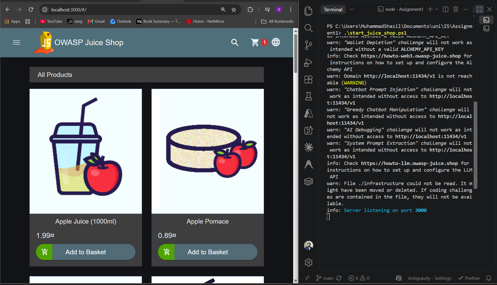

# CS3002 - Information Security
## Assignment #01: OWASP Juice Shop Penetration Testing & Remediation

**Student Name:** Shazil Hamzah  
**Roll No:** 23L-0590  
**Section:** 7E  
**Date:** September 11th, 2026  

---

## Part 0: Environment Setup



---

## The Challenges

---

### Challenge 1: Score Board
- **Tier:** Tier 1 — Recon & Basics
- **OWASP Category:** Security Misconfiguration / Information Disclosure

#### 1. How I exploited it:
I kept trying different URL combinations (e.g. scoreboard, score/board, score-board) to find the score board page.

**Exact URL / Payload used:**
```
http://localhost:3000/#/score-board
```

#### 2. Screenshots:
- **Screenshot A: Exploit Succeeded**
  

- **Screenshot B: "Find It" Solved**
  

- **Screenshot C: "Fix It" Solved**
  

#### 3. Explanation (Root Cause & Remediation):
The developers just hid the menu button instead of securing the route, which is security by obscurity. I fixed it by selecting the patch that adds a proper route guard so you can't just access the page by knowing the URL.

---

### Challenge 2: DOM XSS
- **Tier:** Tier 1 — Recon & Basics
- **OWASP Category:** Cross-Site Scripting (XSS)

#### 1. How I exploited it:
I put the given code inside the search bar

**Exact URL / Payload used:**
```html
<iframe src="javascript:alert(`xss`)">
```

#### 2. Screenshots:
- **Screenshot A: Exploit Succeeded**
  

- **Screenshot B: "Find It" Solved**
  

- **Screenshot C: "Fix It" Solved**
  

#### 3. Explanation (Root Cause & Remediation):
The search bar took my input and directly showed it on the page using `bypassSecurityTrustHtml` without cleaning it up first. This is a big mistake because the browser ran the JavaScript I typed. The patch fixes this by removing that bypass function, so Angular can safely sanitize the input like it's supposed to.

---

### Challenge 3: Confidential Document
- **Tier:** Tier 1 — Recon & Basics
- **OWASP Category:** Sensitive Data Exposure / Broken Access Control

#### 1. How I exploited it:
Ran the script to fetch all <a> tags and found the hidden link and found this link: http://localhost:3000/ftp

**Exact URL / Payload used:**
```javascript
const urls = Array.from(document.querySelectorAll('a')).map(a => a.href);
console.log(Array.from(new Set(urls)).join('\n'));
```

#### 2. Screenshots:
- **Screenshot A: Exploit Succeeded**
  

- **Screenshot B: "Find It" Solved**
  

- **Screenshot C: "Fix It" Solved**
  

#### 3. Explanation (Root Cause & Remediation):
The server allowed anyone to list all the files in the FTP directory just by visiting the URL, exposing sensitive documents. This happened because directory listing wasn't properly disabled. The patch fixes it by explicitly blocking access to confidential file extensions like `.md` and `.pdf` inside that folder.

---

### Challenge 4: Login Admin
- **Tier:** Tier 2 — Authentication & Access
- **OWASP Category:** Injection (SQL Injection)

#### 1. How I exploited it:
Added this payload in email section such that it will ignore the password and return True without password. 

**Exact Input / Payload used:**
```sql
' or 1=1--
```

#### 2. Screenshots:
- **Screenshot A: Exploit Succeeded**
  

- **Screenshot B: "Find It" Solved**
  

- **Screenshot C: "Fix It" Solved**
  

#### 3. Explanation (Root Cause & Remediation):
The backend blindly pasted my email input directly into the database query string without checking it, letting my payload rewrite the query logic. This is a classic SQL injection flaw. The patch fixes this by using a parameterized query (prepared statement) instead, which forces the database to treat my input as plain text rather than executable code.

---

### Challenge 5: Password Strength
- **Tier:** Tier 2 — Authentication & Access
- **OWASP Category:** Broken Authentication

#### 1. How I exploited it:
From the previous challenge, the admin email was leaked and then i used that email and tried the most commonly used passwords to get my way in.

**Exact Credentials used:**
```text
Email: admin@juice-sh.op
Password: admin123
```

#### 2. Screenshots:
- **Screenshot A: Exploit Succeeded**
  

- **Screenshot B: "Find It" Solved**
  

- **Screenshot C: "Fix It" Solved**
  

#### 3. Explanation (Root Cause & Remediation):
The root cause was simply that the admin never bothered to change the default password, making it super easy to guess and brute-force. This is a severe broken authentication issue. The patch fixes this by enforcing a strong password policy and making sure predictable default passwords aren't hardcoded into the system setup.

---

### Challenge 6: Admin Section
- **Tier:** Tier 2 — Authentication & Access
- **OWASP Category:** Broken Access Control

#### 1. How I exploited it:
1. guessed multiple urls and found it under administration url.

**Exact Route / Payload used:**
```text
localhost:3000/administration
```

#### 2. Screenshots:
- **Screenshot A: Exploit Succeeded**
  

- **Screenshot B: "Find It" Solved**
  

- **Screenshot C: "Fix It" Solved**
  

#### 3. Explanation (Root Cause & Remediation):
Similar to the score board, the backend API for the administration section wasn't properly verifying if I was actually logged in as an admin. It relied purely on hiding the frontend link. The patch fixes this by implementing a proper server-side role check, ensuring that only users with an admin token can access the data.

---

### Challenge 7: Reset Jim's Password
- **Tier:** Tier 3 — Exploitation
- **OWASP Category:** Broken Authentication / OSINT

#### 1. How I exploited it:
1. got jim email from administration panel
2. logged in using sql injection to jim's account
3. in jim's delivery addresses, there was also sam's address which might be his eldest brother
4. searched the sam name and address on google and it gave the middle name as Samuel

**Security Question & Answer used:**
```text
User / Email: jim@juice-sh.op
Security Question: Jim's eldest brother middle name 
Answer: Samuel
New Password: shazil
```

#### 2. Screenshots:
- **Screenshot A: Exploit Succeeded**
  

- **Screenshot B: "Find It" Solved**
  

- **Screenshot C: "Fix It" Solved**
  

#### 3. Explanation (Root Cause & Remediation):
The security question system relied on public knowledge that anyone can easily google or find out through OSINT (Open Source Intelligence). This basically ruins the whole point of a password reset feature. The patch fixes this by requiring much stronger authentication methods for password resets that don't depend on guessable pop-culture trivia or public info.
